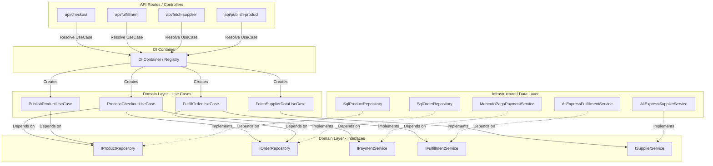

# 🏛️ Documentação de Arquitetura Dropshipping (SOLID & Clean Architecture)

Este documento detalha o design de software, os padrões arquiteturais e o sistema de **Injeção de Dependências (DI)** implementados na aplicação `apps/web`.

---

## 🗺️ Visão Geral da Arquitetura

O projeto adota os princípios de **Clean Architecture** (Arquitetura Limpa), dividindo o sistema em camadas concêntricas e isoladas. A regra de ouro é: **as dependências de código sempre apontam para dentro**. Camadas de alto nível (regras de negócio) nunca dependem de camadas de baixo nível (banco de dados, frameworks ou APIs externas).



---

## 🧱 As Camadas da Aplicação

### 1. Camada de Domínio (`domain/`)
Contém o núcleo das regras de negócio. É pura, escrita em TypeScript puro e **não possui dependências** de nenhuma biblioteca externa, banco de dados ou framework (como Next.js ou Neon SQL).
*   **Use Cases (Casos de Uso):** Classes que implementam as ações que o sistema pode realizar (ex: `ProcessCheckoutUseCase`). Eles contêm a lógica e orquestração do domínio.
*   **Interfaces (Abstrações):** Contratos de comunicação definidos no domínio para que outras camadas implementem (ex: `IProductRepository`, `IPaymentService`).

### 2. Camada de Infraestrutura e Dados (`infrastructure/` & `data/`)
Contém os detalhes tecnológicos de baixo nível. Implementa as interfaces declaradas no domínio.
*   **Repositories (Repositórios):** Classes que implementam a persistência em banco de dados usando consultas SQL para o Neon DB (ex: `SqlProductRepository`).
*   **Services (Serviços):** Adaptadores para APIs e ferramentas externas (ex: `MercadoPagoPaymentService` encapsula a API de pagamentos, `AliExpressFulfillmentService` encapsula o SDK `ae_sdk`).

### 3. Camada de Apresentação e Controle (API Routes / Controllers)
As rotas serverless do Next.js App Router (`app/api/`).
*   Recebem as requisições HTTP (`req`).
*   Não contêm lógica de negócio.
*   Apenas invocam os Casos de Uso através do **DI Container** e retornam as respostas em JSON (`NextResponse`).

---

## ⚡ Injeção de Dependências (DI Container)

Para acoplar a infraestrutura ao domínio de forma limpa, utilizamos o padrão **Dependency Injection Container (Registry)** em [container.ts](file:///C:/Users/xteme/projetos/Dropshipping/apps/web/infrastructure/di/container.ts).

### Por que esse padrão é superior?
1.  **Lazy Loading (Inicialização Sob Demanda):** As classes (como conexões de banco de dados ou clients de API) só são instanciadas no exato momento em que são chamadas pela primeira vez, poupando CPU e memória do servidor (essencial para Next.js Edge Runtime).
2.  **Singleton Pattern Controlado:** Repositórios e serviços são reutilizados como instâncias únicas na memória durante o ciclo de vida da requisição serverless.
3.  **Desacoplamento nos Controles:** As rotas HTTP não precisam conhecer como instanciar classes complexas nem passar parâmetros em cascata no construtor.

Exemplo de uso na rota HTTP:
```typescript
import { container } from '../../../infrastructure/di/container';

// O Container entrega o caso de uso pronto, com todas as dependências (banco, gateways) já injetadas!
const useCase = container.processCheckoutUseCase;
const result = await useCase.execute(dadosDoCheckout);
```

---

## 📐 Satisfazendo os Princípios SOLID

A nova arquitetura do projeto atende com maestria às diretrizes SOLID:

### 🟢 S - Single Responsibility Principle (Princípio de Responsabilidade Única)
Cada classe possui apenas um motivo para mudar:
*   `ProcessCheckoutUseCase` apenas orquestra o fluxo de checkout. Ele não sabe como processar Pix (delega para o `IPaymentService`) nem como salvar no banco (delega para o `IOrderRepository`).
*   `MercadoPagoPaymentService` muda apenas se a API do MercadoPago mudar.

### 🟢 O - Open-Closed Principle (Princípio Aberto-Fechado)
O sistema é aberto para extensão, mas fechado para modificação.
*   Se amanhã quisermos mudar o gateway de pagamento para o **Stripe**, nós criamos uma nova classe `StripePaymentService` implementando a interface `IPaymentService`. **Zero linhas** de código do `ProcessCheckoutUseCase` precisarão ser alteradas!

### 🟢 L - Liskov Substitution Principle (Princípio de Substituição de Liskov)
Qualquer classe que implementa uma interface pode ser substituída sem quebrar o sistema.
*   Durante a execução dos testes automatizados, podemos injetar uma classe `MockOrderRepository` no lugar da real `SqlOrderRepository`. Como ambas implementam `IOrderRepository`, o caso de uso executa com perfeição sem perceber a diferença.

### 🟢 I - Interface Segregation Principle (Princípio de Segregação de Interface)
Interfaces pequenas, focadas e coesas:
*   Os Casos de Uso dependem apenas dos métodos que realmente utilizam. Não criamos interfaces gigantes com dezenas de métodos genéricos e não utilizados.

### 🟢 D - Dependency Inversion Principle (Princípio de Inversão de Dependência)
Módulos de alto nível não dependem de módulos de baixo nível. Ambos dependem de abstrações (interfaces).
*   `FulfillOrderUseCase` (Alto nível) não importa mais o SDK do AliExpress diretamente (Baixo nível). Ele depende apenas do contrato abstrato `IFulfillmentService`. A conexão concreta é injetada dinamicamente via construtor através do DI Container.

---

## 🛠️ Como adicionar uma nova funcionalidade (Guia do Desenvolvedor)

Caso você queira adicionar um novo recurso (por exemplo, "Envio de E-mail de Confirmação"):

1.  **Defina a interface no Domínio:**
    Crie `apps/web/domain/interfaces/IEmailService.ts`:
    ```typescript
    export interface IEmailService {
      sendOrderConfirmation(email: string, orderId: string): Promise<void>;
    }
    ```
2.  **Implemente na Infraestrutura:**
    Crie `apps/web/infrastructure/services/ResendEmailService.ts`:
    ```typescript
    import { IEmailService } from '../../domain/interfaces/IEmailService';
    
    export class ResendEmailService implements IEmailService {
      async sendOrderConfirmation(email: string, orderId: string) {
        // Lógica real de envio usando Resend API
      }
    }
    ```
3.  **Atualize o DI Container:**
    Adicione o novo serviço no [container.ts](./apps/web/infrastructure/di/container.ts) e injete-o no construtor do caso de uso desejado.
